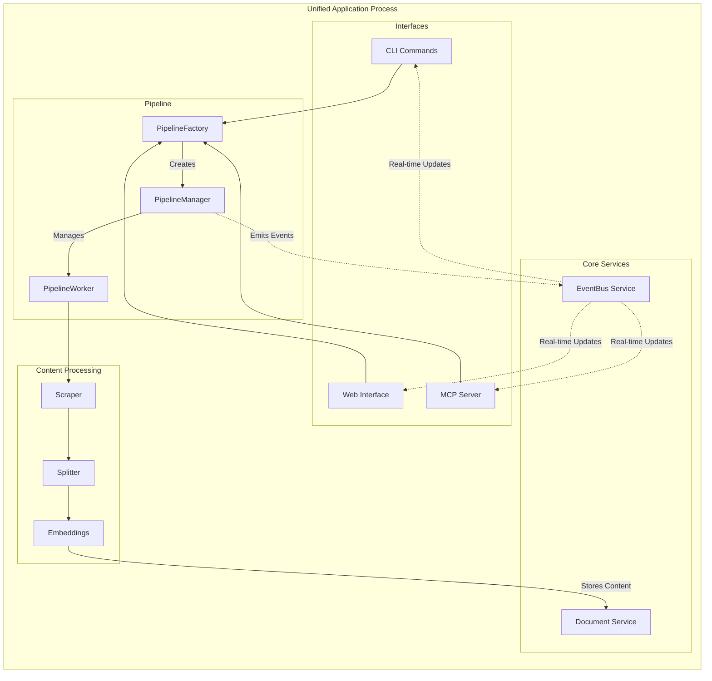
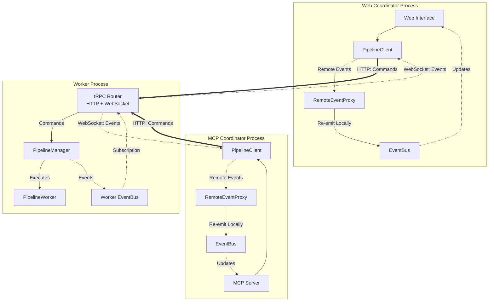

# Documentation MCP Server Architecture

## System Overview

The Documentation MCP Server indexes documentation from web sources, local files, and package registries, making it searchable via the Model Context Protocol (MCP). The system processes content into vector embeddings and provides search capabilities to AI coding assistants.

### Core Functions

- Documentation scraping from web, local files, npm/PyPI registries
- Semantic search using vector embeddings (OpenAI, Google, Azure, AWS providers)
- Version-specific documentation queries
- Asynchronous job processing with recovery
- Multiple access interfaces: CLI, MCP protocol, web UI

### Deployment Modes

The system runs in two modes:

**Unified Server**: Single process containing MCP server, web interface, and embedded worker. Default mode for development and simple deployments.

**Distributed Mode**: Separate coordinator and worker processes. Used for scaling processing workload across multiple containers.

Protocol selection is automatic - stdio transport for AI tools (no TTY), HTTP transport for interactive terminals (has TTY).

### Technology Stack

- Node.js 22.x, TypeScript, Vite build system
- Vitest for testing
- HTMX, AlpineJS, TailwindCSS for web interface
- LangChain.js for embeddings, Playwright for scraping
- SQLite with schema migrations

### Directory Structure

```
src/
├── index.ts                         # Main entry point with CLI, protocol detection
├── app/                             # Unified server implementation
│   ├── AppServer.ts                 # Modular service composition
│   └── AppServerConfig.ts           # Service configuration interface
├── mcp/                             # MCP server implementation
│   ├── mcpServer.ts                 # MCP protocol server
│   ├── tools.ts                     # MCP tool definitions
│   └── startStdioServer.ts          # Stdio transport setup
├── pipeline/                        # Asynchronous job processing
│   ├── PipelineFactory.ts           # Smart pipeline selection
│   ├── PipelineManager.ts           # Job queue and worker coordination
│   ├── PipelineClient.ts            # External worker RPC client (tRPC)
│   ├── PipelineWorker.ts            # Individual job execution
│   └── trpc/                        # tRPC router for pipeline procedures
├── scraper/                         # Content acquisition and processing
│   ├── fetcher/                     # HTTP and file content fetching
│   ├── middleware/                  # Content transformation pipeline
│   ├── pipelines/                   # Content-type-specific processing
│   ├── strategies/                  # Source-specific scraping strategies
│   └── utils/                       # Scraping utilities
├── services/                        # Service registration functions
├── splitter/                        # Document chunking and segmentation
│   ├── GreedySplitter.ts            # Universal size optimization
│   ├── SemanticMarkdownSplitter.ts  # Structure-aware markdown splitting
│   ├── JsonDocumentSplitter.ts      # Hierarchical JSON splitting
│   ├── TextDocumentSplitter.ts      # Line-based text/code splitting
│   └── splitters/                   # ContentSplitter implementations (deprecated)
├── store/                           # Data storage and retrieval
├── tools/                           # Business logic implementations
├── types/                           # Shared TypeScript interfaces
├── utils/                           # Common utilities
└── web/                             # Web interface implementation
```

## System Architecture

The system uses a layered architecture where interfaces delegate to shared tools, which coordinate pipeline operations for content processing and storage. The architecture supports two deployment modes with different event flow patterns.

### Unified Mode (Local In-Process)

In unified mode, all components run within a single process. The `PipelineManager` executes jobs directly and emits events to the local `EventBus`, which notifies all consumers in real-time.



**Key Characteristics:**

- Direct method calls between components
- Local event propagation via `EventBus`
- Immediate job status updates
- Simple deployment (single process)

### Distributed Mode (Hub & Spoke)

In distributed mode, the worker runs as a separate process. Multiple coordinators (Web UI, MCP Server) connect to the shared worker via tRPC. Each coordinator uses `PipelineClient` to send commands over HTTP and receive real-time events via WebSocket. The `RemoteEventProxy` bridges remote events into the local `EventBus`, making the distributed setup transparent to consumers.



**Key Characteristics:**

- **Hub**: Shared worker process executes all jobs
- **Spokes**: Independent coordinator processes (Web, MCP, CLI)
- **Split-Link Communication**: HTTP for commands, WebSocket for events
- **Event Bridging**: `RemoteEventProxy` makes remote events appear local
- **Scalability**: Multiple coordinators can share one worker
- **Transparency**: Consumers use the same `EventBus` API regardless of mode

### Protocol Auto-Detection

The entry point resolves protocol based on TTY status:

- No TTY (stdin/stdout redirected): stdio transport for direct MCP communication
- Has TTY (interactive terminal): HTTP transport with Server-Sent Events
- Manual override: `--protocol stdio|http` bypasses detection

### Pipeline Selection

The PipelineFactory chooses implementation based on configuration:

Naming clarifies the mode: PipelineManager runs an in-process worker; PipelineClient connects to an out-of-process worker via tRPC.

- `serverUrl` specified: PipelineClient for external worker communication
- `recoverJobs: true`: PipelineManager with job recovery from database
- `recoverJobs: false`: PipelineManager without recovery (CLI commands)

## Core Components

### Tools Layer

Business logic resides in the tools layer to enable code reuse across interfaces. Tools operate on shared pipeline and storage services, eliminating interface-specific implementations. CLI commands, MCP endpoints, and web routes all delegate to the same tool implementations.

The tools layer includes:

- Document scraping with configuration persistence
- Semantic search across indexed content
- Library and version management
- Job lifecycle management (status, progress, cancellation)
- URL fetching and markdown conversion

### Pipeline Management

The pipeline system manages asynchronous job processing with persistent state and real-time event propagation:

**PipelineManager**: Coordinates job queue, concurrency limits, and state synchronization. Maintains write-through architecture where job state updates immediately persist to database. Emits events to `EventBus` for real-time status updates to all consumers.

**PipelineWorker**: Executes individual jobs, orchestrating content fetching, processing, and storage. Reports progress through callbacks to the manager, which are converted to events.

**PipelineClient**: tRPC client that provides identical interface to PipelineManager for external worker communication. Uses event-driven `waitForJobCompletion` via `EventBus` subscription instead of polling.

**RemoteEventProxy**: Bridges events from external workers to the local `EventBus`. Subscribes to the worker's tRPC event stream (WebSocket) and re-emits events locally, making distributed execution transparent to consumers.

**EventBus**: Central pub/sub service that decouples event producers (PipelineManager) from consumers (CLI, Web UI, MCP). Enables real-time updates without direct coupling between components.

Job states progress through: QUEUED → RUNNING → COMPLETED/FAILED/CANCELLED. All state transitions persist to database and emit events, enabling both recovery after restart and real-time monitoring. See [Event Bus Architecture](docs/concepts/eventbus-architecture.md) for detailed event flow diagrams.

### Content Processing

Content processing follows a modular strategy-pipeline-splitter architecture:

1. **Scraper Strategies**: Handle different source types (web, local files, package registries)
2. **Content Fetchers**: Retrieve raw content from various sources (HTTP, filesystem, APIs)
3. **Processing Pipelines**: Transform content using middleware chains and content-type-specific logic
4. **Document Splitters**: Segment content into semantic chunks preserving document structure
5. **Size Optimization**: Apply universal chunk sizing for optimal embedding generation
6. **Embedders**: Generate vector embeddings using configured provider

The system uses a two-phase splitting approach: semantic splitting preserves document structure, followed by size optimization for embedding quality. See [Content Processing](docs/concepts/content-processing.md) for detailed processing flows.

### Storage Architecture

SQLite database with normalized schema:

- `libraries`: Library metadata and organization
- `versions`: Version tracking with indexing status and configuration
- `documents`: Content chunks with embeddings and metadata

The `versions` table serves as the job state hub, storing progress, errors, and scraper configuration for reproducible re-indexing.

DocumentManagementService handles CRUD operations and version resolution. DocumentRetrieverService provides hybrid search combining vector similarity and full-text search using Reciprocal Rank Fusion (RRF) with configurable weights. The search system implements dual-mode FTS query generation for improved recall (combining exact phrase and keyword matching) and uses an overfetch factor to retrieve more candidates before final ranking.

## Interface Implementations

### Web Interface

Server-side rendered application using Fastify with JSX components. HTMX provides dynamic updates without client-side JavaScript frameworks. AlpineJS handles client-side interactivity within components.

Routes delegate to tools layer for data operations. Components poll for job status updates every 3 seconds, displaying progress bars and status changes in real-time.

HTMX and AlpineJS integration uses custom events to decouple component interactions from global HTMX state.

### MCP Protocol Integration

The MCP server exposes tools as protocol-compliant endpoints. Multiple transports are supported:

- **stdio transport**: For command-line integration and AI tools
- **HTTP transport**: Provides `/mcp` (Streamable HTTP) and `/sse` (Server-Sent Events) endpoints

Protocol selection is automatic - stdio transport for AI tools (no TTY), HTTP transport for interactive terminals (has TTY).

Available MCP tools mirror CLI functionality: document scraping, search, library management, and job control. Tools maintain identical interfaces across CLI and MCP access methods.

### Configuration and Deployment

Configuration uses environment variables with sensible defaults. Database location auto-detects project-local storage or system application directory.

The AppServer provides modular service composition, enabling selective feature activation based on deployment requirements.

## Development Guidelines

### Code Organization

- Tools implement business logic with interface-agnostic design
- Pipeline components handle asynchronous processing concerns
- Storage layer abstracts database operations with migration support
- Interfaces delegate to tools rather than implementing logic directly

### Testing Strategy

Tests focus on public API behavior and observable side effects. Mock only external dependencies (databases, APIs, filesystem). Tests should remain stable across refactoring by avoiding implementation detail assertions.

### Logging

Hierarchical logging strategy:

- Tools layer: User-facing operations and results
- Core components: Operational status and state changes
- Processing layer: Detailed progress and error conditions

Use `console.*` for direct user output, `logger.*` for application events.

### Error Handling

Errors propagate through the tools layer with context preservation. Job failures store detailed error information for debugging and user feedback.

## Architectural Patterns

### Write-Through Architecture

Pipeline jobs serve as single source of truth, containing both runtime state and database fields. All updates immediately synchronize to database, ensuring consistency and recovery capability.

### Functionality-Based Design

Components are selected based on capability requirements rather than deployment context. PipelineFactory chooses implementations based on desired functionality (embedded vs external, recovery vs immediate).

### Protocol Abstraction

Transport layer abstracts stdio vs HTTP differences, enabling identical tool functionality across access methods.

## Extension Points

New functionality should follow established patterns:

- Implement core logic in tools layer for interface reuse
- Add pipeline workers for new content processing types
- Extend scraper middleware for additional content sources
- Use migration system for schema changes

## References

Detailed documentation for specific architectural areas:

### Concepts

- [Event Bus Architecture](docs/concepts/eventbus-architecture.md) - Event-driven architecture and real-time updates
- [Pipeline Architecture](docs/concepts/pipeline-architecture.md) - Job processing and worker coordination
- [Content Processing](docs/concepts/content-processing.md) - Scraping and document processing
- [Data Storage](docs/concepts/data-storage.md) - Database design and embedding management
- [Refresh Architecture](docs/concepts/refresh-architecture.md) - Efficient re-indexing with change detection
- [Splitter Hierarchy](docs/concepts/splitter-hierarchy.md) - Document chunk organization and hierarchy
- [Search Result Reassembly](docs/concepts/search-result-reassembly.md) - Search result processing and assembly
- [Source Code Splitter](docs/concepts/source-code-splitter.md) - Source code chunking strategies
- [Content Agnostic Assembly](docs/concepts/content-agnostic-assembly.md) - Content assembly patterns

### Infrastructure

- [Deployment Modes](docs/infrastructure/deployment-modes.md) - Protocol detection and server modes
- [Authentication](docs/infrastructure/authentication.md) - OAuth2 authentication and security
- [Telemetry](docs/infrastructure/telemetry.md) - Privacy-first telemetry architecture
