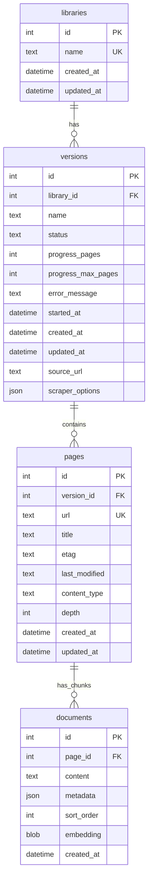

# Data Storage

## Overview

The storage system uses SQLite with a normalized, four-table schema design for efficient document storage, retrieval, and version management. The schema supports page-level metadata tracking, ETag-based change detection, and hierarchical document chunking.

## Database Schema

The database consists of four core tables with normalized relationships:

### Libraries Table

Core library metadata and organization.

**Schema:**
- `id` (INTEGER PRIMARY KEY): Auto-increment identifier
- `name` (TEXT UNIQUE): Library name (case-insensitive)
- `created_at` (DATETIME): Creation timestamp
- `updated_at` (DATETIME): Last update timestamp

**Purpose:** Library name normalization and metadata storage.

**Code Reference:** `src/store/types.ts` - Type definitions used throughout DocumentManagementService

### Versions Table

Version tracking with comprehensive status and configuration.

**Schema:**
- `id` (INTEGER PRIMARY KEY): Auto-increment identifier
- `library_id` (INTEGER FK): References libraries(id)
- `name` (TEXT): Version name (NULL for unversioned content)
- `status` (TEXT): Version indexing status (not_indexed, queued, running, completed, failed, cancelled, updating)
- `progress_pages` (INTEGER): Current page count during indexing
- `progress_max_pages` (INTEGER): Maximum pages to index
- `error_message` (TEXT): Error details if indexing fails
- `started_at` (DATETIME): When indexing job started
- `created_at` (DATETIME): Creation timestamp
- `updated_at` (DATETIME): Last update timestamp
- `source_url` (TEXT): Original scraping URL
- `scraper_options` (JSON): Stored scraper configuration for reproducibility

**Purpose:** Job state management, progress tracking, and scraper configuration persistence.

**Code Reference:** `src/store/types.ts` lines 184-201 (DbVersion interface)

### Pages Table

Page-level metadata for each unique URL within a version.

**Schema:**
- `id` (INTEGER PRIMARY KEY): Auto-increment identifier
- `version_id` (INTEGER FK): References versions(id)
- `url` (TEXT): Page URL (unique per version)
- `title` (TEXT): Page title extracted from content
- `etag` (TEXT): HTTP ETag for change detection
- `last_modified` (TEXT): HTTP Last-Modified header
- `content_type` (TEXT): MIME type of the content
- `depth` (INTEGER): Crawl depth from source URL (0 = root page)
- `created_at` (DATETIME): Creation timestamp
- `updated_at` (DATETIME): Last update timestamp

**Purpose:** Page-level metadata tracking, ETag-based refresh support, and depth tracking for scoping.

**Code Reference:** 
- `db/migrations/009-add-pages-table.sql` - Initial pages table creation
- `db/migrations/010-add-depth-to-pages.sql` - Depth column addition
- `src/store/types.ts` lines 9-20 (DbPage interface)

### Documents Table

Document chunks with embeddings and hierarchical metadata.

**Schema:**
- `id` (INTEGER PRIMARY KEY): Auto-increment identifier
- `page_id` (INTEGER FK): References pages(id)
- `content` (TEXT): Chunk content text
- `metadata` (JSON): Chunk-specific metadata (level, path, types)
- `sort_order` (INTEGER): Ordering within page
- `embedding` (BLOB): Vector embedding as binary data
- `created_at` (DATETIME): Creation timestamp

**Purpose:** Content storage with vector embeddings, hierarchical metadata, and search optimization.

**Code Reference:** `src/store/types.ts` lines 39-48 (DbChunk interface)

## Schema Evolution

### Migration System

Sequential SQL migrations in `db/migrations/`:

1. `000-initial-schema.sql` - Base schema with documents, FTS, and vector tables
2. `001-add-indexed-at-column.sql` - Indexing timestamp tracking
3. `002-normalize-library-table.sql` - Library and version normalization
4. `003-normalize-vector-table.sql` - Vector storage optimization
5. `004-complete-normalization.sql` - Remove redundant columns, finalize schema
6. `005-add-status-tracking.sql` - Job status and progress tracking
7. `006-add-scraper-options.sql` - Configuration persistence for reproducibility
8. `007-dedupe-unversioned-versions.sql` - Enforce unique unversioned content
9. `008-case-insensitive-names.sql` - Case-insensitive library name handling
10. `009-add-pages-table.sql` - Page-level metadata normalization
11. `010-add-depth-to-pages.sql` - Crawl depth tracking for refresh operations

**Code Reference:** All migration files in `db/migrations/` directory

### Migration Application

Automatic migration execution on startup:

- Check current schema version against available migrations
- Apply pending migrations sequentially
- Validate schema integrity after each migration
- Handle migration failures with detailed error messages
- Trigger-based FTS index maintenance

## Data Location

### Storage Directory Resolution

Database location determined by priority:

1. Project-local `.store` directory (development)
2. OS-specific application data directory (production)
3. Temporary directory as fallback

### Default Storage Location

On macOS: `~/Library/Application Support/docs-mcp-server/`

**Code Reference:** `src/utils/paths.ts` - `resolveStorePath()` function

## Document Management

### DocumentManagementService

Handles document lifecycle operations with normalized schema access.

**Core Operations:**

- Document chunk insertion via pages table
- Version management and cleanup
- Library organization with case-insensitive handling
- Page-level metadata management
- Duplicate detection using unique constraints

**Version Resolution:**

- Exact version name matching
- Semantic version range queries
- Latest version fallback logic
- Unversioned content handling (NULL version name)

**Code Reference:** `src/store/DocumentManagementService.ts`

### Document Storage Flow

1. Create or resolve library record (case-insensitive name)
2. Create version record with job configuration
3. Create page records for each unique URL
4. Process and store document chunks linked to pages
5. Generate and store embeddings as binary BLOB
6. Update version status and progress

## Embedding Management

### Vector Storage

Embeddings stored as BLOB in documents table:

- 1536-dimensional vectors (OpenAI embedding size)
- Provider-agnostic binary serialization
- NULL handling for documents without embeddings
- Direct storage eliminates need for separate vector table

**Code Reference:** `src/store/types.ts` line 4 (VECTOR_DIMENSION constant)

### EmbeddingFactory

Centralized embedding generation supporting multiple providers.

**Supported Providers:**

- **OpenAI:** text-embedding-3-small (default), text-embedding-3-large, custom endpoints
- **Google:** Gemini embedding models, Vertex AI with service account auth
- **Azure:** Azure OpenAI service with custom deployments
- **AWS:** Bedrock embedding models with IAM authentication

**Code Reference:** `src/store/embeddings/EmbeddingFactory.ts`

## Search Implementation

### DocumentRetrieverService

Handles search and retrieval operations with hybrid ranking.

**Search Methods:**

- Vector similarity search using sqlite-vec extension
- Full-text search using FTS5 virtual table
- Hybrid search with Reciprocal Rank Fusion (RRF)
- Context-aware result assembly

**Search Architecture:**

1. Query embeddings generated for vector search
2. FTS5 query for keyword matching
3. Results combined using RRF algorithm
4. Chunks assembled with hierarchical context
5. Results ranked by combined score

**Code Reference:** `src/store/DocumentRetrieverService.ts`

### FTS Implementation

Full-text search using SQLite FTS5:

- Porter stemmer for English language
- Unicode61 tokenizer for international support
- Trigger-based index maintenance (automatic updates)
- External content mode (FTS references documents table)

**Indexed Fields:** content, title, url, path (from metadata)

## Data Consistency

### Write-Through Architecture

Immediate persistence of state changes via database transactions:

- Job status updates to versions table
- Progress tracking during indexing
- Configuration changes with full audit trail
- Error information for debugging

### Transaction Management

Database transactions ensure consistency:

- Atomic page and document insertions
- Version state transitions with validation
- Batch operations for performance
- Automatic rollback on errors

### Concurrent Access

Safe concurrent database access:

- Better-sqlite3 with synchronous API
- Transaction-based locking
- Read operations don't block each other
- Write operations serialize automatically

**Code Reference:** `src/store/` - All service classes use transaction blocks

## Performance Considerations

### Index Strategy

Database indexes optimize query performance:

- Primary keys on all tables (automatic)
- Foreign key indexes for join performance
- FTS5 indexes for text search
- Composite indexes for common query patterns (library_id + status)

**Code Reference:** Index creation statements in migration files

### Query Optimization

Efficient query patterns throughout the codebase:

- Prepared statements for repeated queries
- Batch operations for bulk inserts
- JOIN queries to minimize round trips
- Query result pagination for large result sets

### Storage Efficiency

Space-efficient data storage:

- Binary embedding storage (BLOB format)
- JSON metadata for flexible chunk properties
- Normalized schema eliminates redundant data
- SQLite VACUUM operations for space reclamation

## Backup and Recovery

### Data Export

Export functionality through DocumentManagementService:

- Complete database export via SQLite backup API
- Library-specific export using filtered queries
- Version-specific export for portability
- Metadata preservation in JSON format

### Data Import

Import from external sources:

- Database restoration from backups
- Configuration-based re-indexing
- Duplicate detection during import (unique constraints)
- Automatic migration application

### Disaster Recovery

Recovery mechanisms:

- Database integrity checks on startup
- Transaction log for crash recovery (SQLite WAL mode)
- Schema validation after migration
- Automatic repair for corrupted indexes

## Monitoring and Maintenance

### Database Health

Health monitoring capabilities:

- Storage space utilization tracking
- Query performance metrics via logging
- Connection status monitoring
- Error rate tracking in version records

### Maintenance Operations

Regular maintenance tasks:

- VACUUM operations for space recovery
- Index rebuilding via REINDEX
- Orphaned record cleanup via foreign key constraints
- Performance analysis using EXPLAIN QUERY PLAN

### Diagnostics

Debugging and diagnostic capabilities:

- Query execution analysis
- Storage space breakdown by table
- Relationship integrity checks via PRAGMA foreign_key_check
- Performance bottleneck identification
