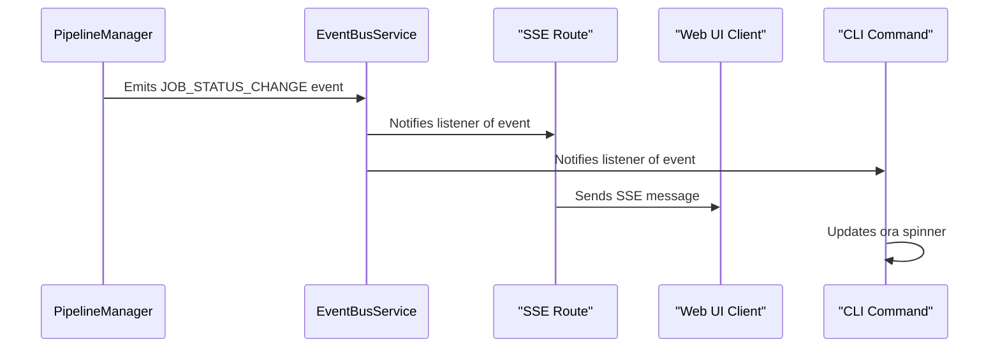
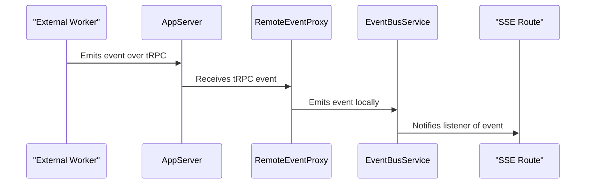

# Event Bus Architecture

This document describes the event-driven architecture used for real-time communication between backend services and the web UI. The system uses a central event bus to decouple event producers from consumers, enabling flexible and scalable status updates.

## Overview

The core of the system is the `EventBusService`, an in-memory pub/sub service. It allows different parts of the application, such as the job processing pipeline, to emit events without being directly coupled to the components that consume them, like the Server-Sent Events (SSE) endpoint for the web UI.

This architecture achieves two primary goals:

1.  **Decoupling:** The `PipelineManager` does not need to know about the web server or its clients. It simply emits events about its state.
2.  **Real-Time Updates:** The web UI receives immediate feedback on background job progress and status changes.

## Core Components

| Component          | Location                   | Responsibility                                                                                                                                         |
| :----------------- | :------------------------- | :----------------------------------------------------------------------------------------------------------------------------------------------------- |
| `PipelineManager`  | `src/pipeline/`            | Manages the lifecycle of scraping and indexing jobs. It is the primary **producer** of job-related events, emitting directly to the `EventBusService`. |
| `EventBusService`  | `src/events/`              | The central pub/sub bus that receives all events and distributes them to registered listeners.                                                         |
| **SSE Route**      | `src/web/routes/events.ts` | A **consumer** that listens to the event bus and forwards events to connected web UI clients over SSE.                                                 |
| `RemoteEventProxy` | `src/events/`              | Subscribes to events from an external worker via tRPC and re-emits them on the local event bus.                                                        |
| **CLI Commands**   | `src/cli/commands/`        | CLI commands subscribe to events from the event bus to display progress indicators (using `ora` spinner).                                              |

## Local Event Flow

The following diagram illustrates the flow of an event when the worker is running within the same process as the web server.

1.  The `PipelineManager` updates the status of a job and directly emits a `JOB_STATUS_CHANGE` event to the `EventBusService`.
2.  The `EventBusService` forwards the event to all its registered listeners:
    - The SSE Route (for web UI updates)
    - CLI commands (for terminal progress indicators)
3.  The SSE Route formats the event data and sends it to all connected web UI clients.
4.  CLI commands update their progress indicators (e.g., `ora` spinner).

## External Worker Event Flow

When using an external worker, the `RemoteEventProxy` ensures events are seamlessly integrated into the local system.

1.  An event occurs in the external worker process.
2.  The event is sent to the `AppServer` via a tRPC subscription.
3.  The `RemoteEventProxy` on the `AppServer` receives the event.
4.  The proxy re-emits the event on the local `EventBusService`, at which point it follows the same flow as a local event.

## Key Event Types

| Event Name          | Payload                                                | Description                                                                          |
| :------------------ | :----------------------------------------------------- | :----------------------------------------------------------------------------------- |
| `JOB_STATUS_CHANGE` | `PipelineJob`                                          | Fired when a job's status changes (e.g., QUEUED, RUNNING, COMPLETED).                |
| `JOB_PROGRESS`      | `{ job: PipelineJob, progress: ScraperProgressEvent }` | Fired periodically during a running job to provide progress updates.                 |
| `LIBRARY_CHANGE`    | `undefined`                                            | Fired when a library's state may have changed, signaling the UI to refresh its data. |
