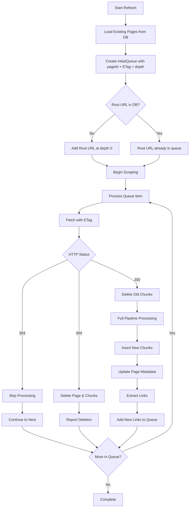

# Refresh Architecture

## Overview

The refresh system enables efficient re-indexing of previously scraped documentation by leveraging **HTTP conditional requests** and **intelligent change detection**. Instead of re-downloading and re-processing all content, refresh operations check each page for modifications and only process what has changed.

**Key efficiency gains:**

- 70-90% reduction in bandwidth usage for typical documentation updates
- Proportional reduction in processing time (unchanged pages skip pipeline entirely)
- Automatic detection and removal of deleted pages
- Discovery and indexing of newly added pages

The refresh system integrates seamlessly with the existing scraping pipeline, using the same strategies, fetchers, and processors as initial indexing operations.

---

## Core Mechanism: Conditional Requests

Refresh operations rely on **ETags** (entity tags) - unique identifiers assigned by web servers to specific versions of a resource. When content changes, the ETag changes.

### How It Works

**Initial Scraping:**

1. Fetch page from server
2. Extract content and links
3. Store content in database **with ETag**
4. Continue to discovered links

**Refresh Operation:**

1. Load existing pages from database (URL + ETag + pageId)
2. Fetch page with `If-None-Match: <stored-etag>` header
3. Server compares ETags and responds:
   - **304 Not Modified** → Content unchanged, skip processing
   - **200 OK** → Content changed, re-process through pipeline
   - **404 Not Found** → Page deleted, remove from index

This approach shifts the burden of change detection to the HTTP layer, where it's handled efficiently by web servers and CDNs.

---

## Status Handling

The system handles three HTTP response statuses during refresh:

| Status Code          | Meaning                             | Database Action                       | Pipeline Action                 |
| -------------------- | ----------------------------------- | ------------------------------------- | ------------------------------- |
| **304 Not Modified** | Content unchanged since last scrape | No changes (preserves existing data)  | Skip pipeline, no re-processing |
| **200 OK**           | Content modified or new page        | Delete old chunks, insert new content | Full pipeline processing        |
| **404 Not Found**    | Page no longer exists               | Delete all documents for this page    | Skip pipeline                   |

### 304 Not Modified Flow

When a page returns 304, the system:

1. Recognizes the page was checked successfully
2. Preserves all existing content in database (no updates)
3. Skips chunking, embedding, and indexing entirely
4. Continues to next page in queue

This is the **fast path** that makes refresh efficient.

### 200 OK Flow

When a page returns 200 with new content, the system:

1. Deletes existing document chunks for this page (by pageId)
2. Re-processes through full pipeline (HTML→Markdown, chunking, embeddings)
3. Inserts new chunks with updated embeddings
4. Updates page metadata (ETag, last_modified, title, etc.)
5. Extracts and follows new links

This ensures modified content is always current.

### 404 Not Found Flow

When a page returns 404, the system:

1. Deletes the page record AND all associated document chunks (by pageId)
2. Reports deletion via progress callback with `deleted: true` flag
3. Does not follow any links from deleted pages

**Note:** The `deletePage()` method performs a complete deletion of the page and all its document chunks. This is a hard delete operation that immediately removes the page from search results. The CASCADE DELETE constraint in the database schema ensures all related documents are automatically removed when a page is deleted.

---

## Database Schema

### Pages Table

The `pages` table stores page-level metadata with the following key fields:

- **`id`**: Primary key for the page
- **`version_id`**: Foreign key to the versions table
- **`url`**: The page's URL (unique per version)
- **`title`**: Page title extracted from content
- **`etag`**: HTTP ETag header for change detection
- **`last_modified`**: HTTP Last-Modified header
- **`content_type`**: MIME type of the content
- **`depth`**: Crawl depth at which the page was discovered
- **`created_at`**: Timestamp when page was first indexed
- **`updated_at`**: Timestamp of last update (automatically maintained by triggers)

The combination of `(version_id, url)` is unique, ensuring one page record per URL per version.

### Documents Table

The `documents` table stores individual content chunks:

- **`id`**: Primary key for the chunk
- **`page_id`**: Foreign key to the pages table
- **`content`**: The text content of this chunk
- **`metadata`**: JSON containing chunk-specific metadata (level, path, types)
- **`sort_order`**: Order of this chunk within the page
- **`embedding`**: Vector embedding for similarity search
- **`created_at`**: Timestamp when chunk was created

Multiple document chunks link to a single page via `page_id`.

---

## Refresh Workflow



---

## Full Re-Crawl Behavior

Despite using conditional requests, refresh operations perform a **full re-crawl** of the documentation structure. This design choice is intentional and critical for correctness.

### Why Full Re-Crawl?

**Link structure can change without content changing:**

- Page A (unchanged, 304) might add a link to new Page B
- Page C might remove a link, making Page D unreachable
- Navigation menus can be updated without content changes

**If we only followed stored pages:**

- Newly added pages are never discovered
- Reorganizations break coverage
- Deleted pages might remain in index indefinitely

### How It Works

1. **Start from root URL** (depth 0) with ETag check
2. **Even if root returns 304**, extract its links and follow them
3. **Discover new pages** not in the database (no ETag, no pageId)
4. **Process discovered pages** through full pipeline
5. **Delete chunks for 404 pages** to remove from search

This approach combines the efficiency of conditional requests (skip unchanged pages) with the completeness of full crawling (find new pages).

---

## Link Discovery and Depth Preservation

### Initial Queue Setup

Refresh operations receive an `initialQueue` parameter containing all previously indexed pages:

```typescript
initialQueue: [
  { url: "https://docs.example.com", depth: 0, pageId: 1, etag: "abc123" },
  {
    url: "https://docs.example.com/guide",
    depth: 1,
    pageId: 2,
    etag: "def456",
  },
  { url: "https://docs.example.com/api", depth: 1, pageId: 3, etag: "ghi789" },
  // ... all other indexed pages
];
```

The **depth value is preserved** from the original scrape. This ensures:

- Pages respect `maxDepth` limits during refresh
- Depth-based filtering works consistently
- Progress tracking shows accurate depth information

### New Page Discovery

When refresh discovers a new page (not in `initialQueue`):

1. Calculate depth based on parent page: `parent.depth + 1`
2. Assign no `pageId` (created during database insert)
3. Process through full pipeline as a new page

### Root URL Handling

The root URL is **always processed**, even if it appears in `initialQueue`:

1. Ensures the entry point is always checked
2. Allows detection of top-level navigation changes
3. Serves as the canonical base for link resolution

The `BaseScraperStrategy` ensures the root URL appears exactly once in the queue, either from `initialQueue` or added explicitly.

---

## Strategy-Specific Behavior

Different scraping strategies handle refresh operations differently based on their data sources:

### WebScraperStrategy

**ETag Source:** HTTP `ETag` header from web servers

**Refresh Characteristics:**

- Most efficient with modern web servers and CDNs
- Supports conditional requests natively
- Handles redirects by updating canonical URLs
- Discovers new pages through link following

**Example Scenario:**

```
Initial: https://docs.example.com/v1.0/guide
After Redirect: https://docs.example.com/v2.0/guide
Action: Update canonical URL, check ETag, process if changed
```

### LocalFileStrategy

**ETag Source:** File modification time (mtime) converted to ISO string

**Refresh Characteristics:**

- Uses filesystem metadata instead of HTTP
- Detects file modifications via mtime comparison
- Discovers new files by scanning directories
- Handles file deletions through missing file detection (ENOENT)

**Trade-offs:**

- mtime less granular than HTTP ETags
- Directory structures must be re-scanned fully
- No network overhead (local filesystem)

### GitHubScraperStrategy

**ETag Source:** Varies by content type

**Refresh Characteristics:**

- Wiki pages: HTTP ETags from GitHub's web interface
- Repository files: GitHub API ETags for raw content
- Mixed approach: Wiki content via web, files via raw.githubusercontent.com

**Complex Scenarios:**

- Root URL discovery returns both wiki URL and file URLs
- Wiki refresh follows standard web strategy
- File refresh checks individual file ETags from raw.githubusercontent.com

**Example Flow:**

```
Root: https://github.com/user/repo
  ↓
Discovers: https://github.com/user/repo/wiki (returns 304 or 200)
Discovers: File URLs as HTTPS blob URLs (e.g., /blob/main/README.md)
```

---

## Database Operations

### Update Patterns

Refresh operations perform different database operations based on status:

**304 Not Modified:**

- No database changes - content and metadata remain unchanged
- Strategy simply continues to next page in queue

**200 OK (Modified Content):**

1. Delete old document chunks for the page
2. Update page metadata via UPSERT (title, etag, last_modified, content_type, depth)
3. Insert new document chunks
4. Update vector embeddings for new chunks

**404 Not Found:**

1. Delete all document chunks for the page
2. Delete the page record itself

**New Page (200 OK, no pageId):**

1. Insert new page record
2. Insert document chunks
3. Generate and store vector embeddings

### Concurrency Handling

The refresh system processes multiple pages concurrently (default: 3 workers). Database operations are:

- **Atomic** - Each page update is a single transaction in PipelineWorker
- **Isolated** - No cross-page dependencies
- **Idempotent** - Delete + Insert pattern is safe to retry on failure

The `visited` set in `BaseScraperStrategy` prevents duplicate processing across concurrent workers.

---

## Performance Characteristics

### Bandwidth Savings

**Typical documentation site refresh:**

- 70-90% of pages unchanged (return 304)
- 5-10% of pages modified (return 200)
- 1-5% of pages deleted (return 404)
- <5% of pages newly added

**Bandwidth reduction:**

- 304 responses: ~1KB (headers only)
- 200 responses: Full page size
- Net reduction: 70-90% compared to full re-indexing

### Processing Time

**Time spent per page:**

- 304: <50ms (HTTP request + no database changes)
- 200: 500-2000ms (fetch + pipeline + chunking + embeddings)
- 404: <100ms (HTTP request + document deletion)

**Overall speedup:**

- Sites with few changes: 5-10x faster than re-indexing
- Sites with many changes: Approaches re-indexing time
- Sweet spot: Weekly/monthly refresh of active documentation

### Network Efficiency

**Request patterns:**

- Single HTTP request per page (no redundant fetches)
- Conditional requests leverage CDN caching
- Failed requests don't retry (404 is definitive)
- Concurrent requests respect `maxConcurrency` limit

---

## Design Trade-offs

### Full Re-Crawl vs. Stored-Only Check

**Decision:** Always re-crawl from root, even during refresh

**Trade-off:**

- ✅ Discovers new pages automatically
- ✅ Detects navigation changes
- ✅ Removes orphaned pages
- ❌ Requires checking all known pages (even if 304)
- ❌ Network requests for unchanged pages

**Rationale:** Correctness over performance. The conditional request mechanism mitigates the performance cost while ensuring complete coverage.

### Hard Deletion vs. Soft Deletion

**Decision:** Hard delete both document chunks and page records

**Trade-off:**

- ✅ Deleted content immediately removed from search
- ✅ Page records completely removed, preventing database bloat
- ✅ Simple implementation (no query filtering needed)
- ✅ Clean database state with no orphaned page records
- ❌ Document chunks and page metadata cannot be recovered
- ❌ No historical tracking of deleted pages

**Rationale:** Search accuracy is paramount. Deleted content must not appear in results. Complete deletion ensures database remains clean and doesn't accumulate empty page records over time. The page metadata loss is acceptable since deleted pages are no longer relevant to the documentation.

### ETag Storage per Page

**Decision:** Store ETags in pages table, not separate cache

**Trade-off:**

- ✅ Simple schema, no joins required
- ✅ Atomic updates (page + ETag together)
- ✅ ETag tied to content version
- ❌ Larger pages table
- ❌ ETag duplication if same content on multiple URLs

**Rationale:** Simplicity and correctness. ETags are intrinsically tied to content versions, not URLs.

---

## Testing Strategy

Refresh behavior is tested at multiple levels:

### Unit Tests (Strategy Level)

Each strategy's test suite includes refresh scenarios:

- Pages returning 304 (skip processing)
- Pages returning 200 (re-process)
- Pages returning 404 (mark deleted)
- New pages discovered during refresh
- Depth preservation from initialQueue

**Example:** `LocalFileStrategy.test.ts` refresh workflow tests

### Integration Tests (Pipeline Level)

End-to-end refresh workflows:

- Multi-page refresh with mixed statuses
- Concurrent refresh operations
- Database consistency after refresh
- Link discovery and depth handling

**Example:** `test/refresh-pipeline-e2e.test.ts`

### Real-World Scenarios

Testing against actual documentation sites:

- GitHub repositories with wiki + files
- NPM package documentation
- Local file hierarchies with modifications

These tests validate that the refresh system handles real content structures correctly.

---

## Future Enhancements

Potential improvements to the refresh system:

### Incremental Refresh

Only check pages modified since last refresh based on timestamps:

- Reduces network requests further
- Risk: Miss changes on infrequently checked pages
- Requires careful timestamp management

### Parallel Strategy Execution

Run multiple strategies simultaneously for multi-source documentation:

- Example: GitHub repo files + NPM registry + official docs
- Requires coordination across strategies
- Complex dependency management

### Smart Re-crawl Scheduling

Adjust refresh frequency based on historical change patterns:

- Stable pages: Check less frequently
- Volatile pages: Check more frequently
- Requires tracking change history per page

### Webhook-Based Updates

Trigger refresh on content update notifications:

- GitHub webhooks for repository changes
- CMS webhooks for documentation updates
- Eliminates polling, reduces latency
- Requires webhook infrastructure

---

## Summary

The refresh architecture achieves **efficient re-indexing** through:

1. **Conditional HTTP requests** - Let servers decide what changed
2. **Full re-crawl** - Ensure complete coverage despite conditional requests
3. **Status-based handling** - Different actions for 304/200/404
4. **Depth preservation** - Maintain original discovery structure
5. **Unified pipeline** - Same code paths as initial scraping

This design balances **performance** (skip unchanged content) with **correctness** (discover all changes) while maintaining **simplicity** (reuse existing infrastructure).

Refresh is not a separate system - it's the same scraping pipeline with smarter change detection.
