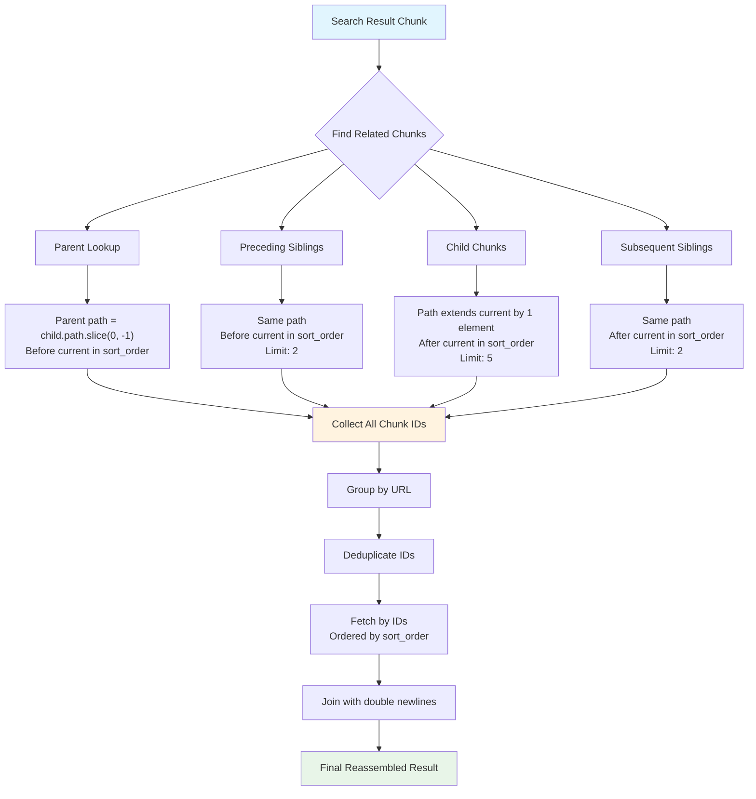

# Search Result Reassembly

## Overview

The search result reassembly system reconstructs coherent document sections from individual chunks stored in the database. When a search query matches specific chunks, the system automatically expands the context by including related chunks (parents, siblings, children) and reassembles them in their original document order.

## Two-Phase Architecture

### Phase 1: Context Expansion

For each search result chunk, the system identifies and collects related chunks using hierarchical relationships:

1. **Parent Chunks**: Broader context at higher levels in the document hierarchy
2. **Preceding Siblings**: Content that appears before the matched chunk at the same hierarchical level
3. **Child Chunks**: More detailed content at deeper levels within the matched section
4. **Subsequent Siblings**: Content that appears after the matched chunk at the same hierarchical level

### Phase 2: Reassembly and Ordering

After collecting all related chunks, the system:

1. **Groups by URL**: Combines chunks from the same document/URL
2. **Deduplicates**: Removes duplicate chunk IDs from overlapping context searches
3. **Orders by sort_order**: Retrieves chunks from database ordered by their original document position
4. **Merges content**: Joins chunk content with double newlines to create coherent text
5. **Preserves metadata**: Maintains highest relevance score and MIME type information

## Hierarchical Relationship Detection

### Path-Based Hierarchy

The system uses the `path` and `level` properties from chunk metadata to determine relationships. For example, a chunk with path `["Guide", "Installation", "Setup"]` at level 3.

### Relationship Detection Rules

- **Parent Detection**: A chunk with path `["A", "B"]` is the parent of chunk with path `["A", "B", "C"]`
- **Child Detection**: Chunks with paths that extend the current chunk's path by exactly one element
- **Sibling Detection**: Chunks with the same path length and same parent path prefix

## Context Expansion Flow



## Context Expansion Limits

The system applies reasonable limits to prevent excessive context expansion:

- **Sibling Limit**: 2 chunks (preceding and subsequent)
- **Child Limit**: 5 chunks
- **Parent Limit**: 1 chunk (by definition)

These limits balance comprehensive context with performance and relevance.

## Processing Overview

The reassembly process follows these key steps:

1. **Initial Search**: Vector similarity and full-text search find chunks matching the query
2. **Context Expansion**: For each result, find related chunks using hierarchical relationships
3. **URL Grouping**: Combine chunks from the same document and deduplicate chunk IDs
4. **Ordered Retrieval**: Fetch all related chunks ordered by their original document position (`sort_order`)
5. **Content Assembly**: Join chunk content with double newlines and preserve highest relevance scores

## Reassembly Examples

### Example 1: Simple Hierarchical Expansion

**Initial Search Result**:

- Chunk: "Installation steps"
- Path: `["Guide", "Installation", "Steps"]`
- Level: 3

**Context Expansion**:

- **Parent**: "Installation overview" (`["Guide", "Installation"]`, level 2)
- **Preceding Sibling**: "Prerequisites" (`["Guide", "Installation", "Prerequisites"]`, level 3)
- **Child**: "Step 1 details" (`["Guide", "Installation", "Steps", "Step1"]`, level 4)
- **Subsequent Sibling**: "Configuration" (`["Guide", "Installation", "Configuration"]`, level 3)

**Final Assembly** (ordered by sort_order):

```
Installation overview

Prerequisites

Installation steps

Step 1 details

Configuration
```

### Example 2: Multiple Search Results from Same Document

**Initial Search Results**:

- Chunk A: "API authentication" (score: 0.9)
- Chunk C: "Error handling" (score: 0.7)

**Context Expansion**:

- Both chunks expand to include their hierarchical context
- All related chunk IDs are collected and deduplicated

**Final Assembly**:

- Single result combining all unique chunks from the document
- Ordered by sort_order (not search relevance order)
- Score: 0.9 (highest from the group)

### Example 3: Cross-Document Results

**Initial Search Results**:

- Document A: "API reference" (score: 0.8)
- Document B: "Tutorial examples" (score: 0.9)

**Final Assembly**:

- Two separate results (one per URL)
- Each with its own hierarchical context expansion
- Maintained separate scoring and metadata

## Database Optimization

### Sort Order Importance

The `sort_order` field is crucial for reassembly:

- **Maintains Document Structure**: Preserves the original order of content as it appeared in the source
- **Enables Coherent Reading**: Reassembled content flows naturally from general to specific
- **Supports Navigation**: Users can understand the logical progression of information

The database uses appropriate indexes on URL, path, and sort_order fields to enable efficient retrieval of related chunks.

## Quality Characteristics

### Content Coherence

- **Hierarchical Flow**: Content progresses logically from general to specific topics
- **Contextual Completeness**: Users receive sufficient context to understand the matched content
- **Natural Reading**: Assembled content reads as coherent sections, not disconnected fragments

### Performance Optimization

- **Batch Retrieval**: All related chunks fetched in single database call
- **Limited Expansion**: Reasonable limits prevent excessive context bloat
- **Efficient Queries**: Database queries leverage path structure and sort order for fast retrieval

### Search Relevance

- **Score Preservation**: Highest relevance score maintained for each document group
- **Context Weighting**: Primary search matches drive overall relevance, context provides support
- **Metadata Consistency**: MIME type and URL information preserved accurately

## Error Handling

### Missing Relationships

- **Orphaned Chunks**: Chunks without parents still return valid results with available context
- **Broken Hierarchies**: Malformed paths degrade gracefully to available relationships
- **Empty Context**: Chunks with no related content still return as single-chunk results

### Database Consistency

- **Transaction Safety**: Context expansion uses consistent database snapshots
- **Missing Chunks**: Individual missing chunks don't break overall reassembly
- **Schema Evolution**: Path format changes handled through migration scripts

## Future Enhancements

### Code Block Merging

Planned enhancement for source code content:

- **Syntax-Aware Joining**: Merge code chunks at appropriate syntactic boundaries
- **Comment Preservation**: Maintain code comments and documentation strings
- **Import Resolution**: Include necessary import statements in reassembled code

### Adaptive Context Limits

Potential improvements for context expansion:

- **Content-Type Aware Limits**: Different limits for code vs. documentation
- **User Preference Integration**: Configurable context expansion preferences
- **Query-Specific Tuning**: Adjust context based on query type and intent
