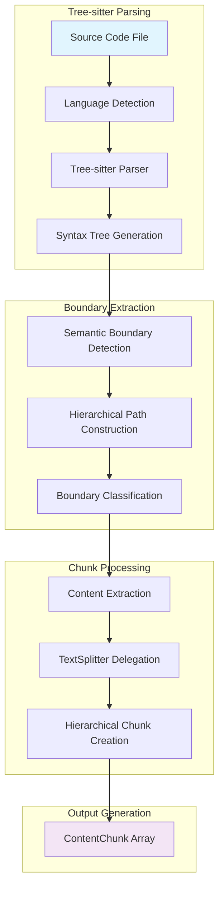
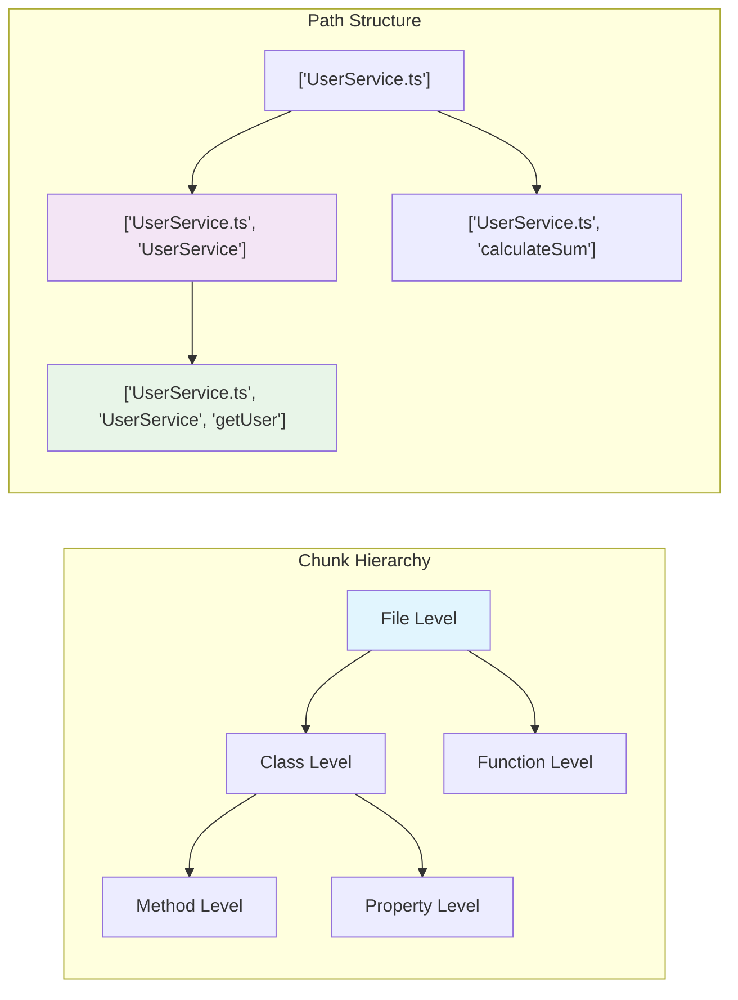
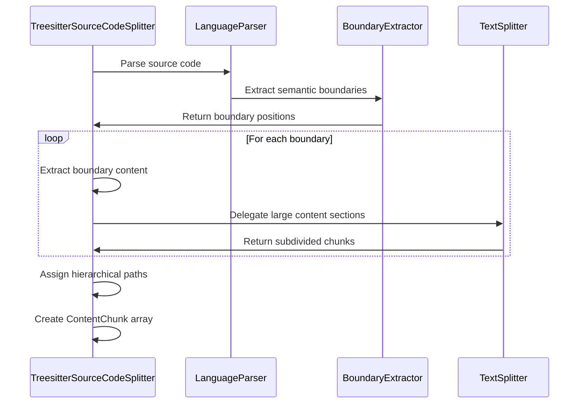
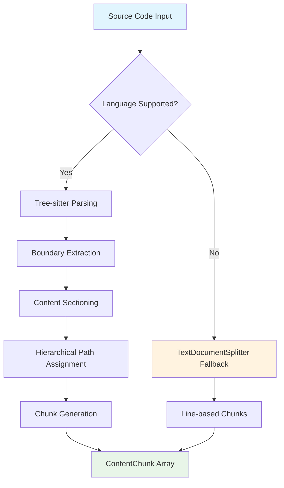
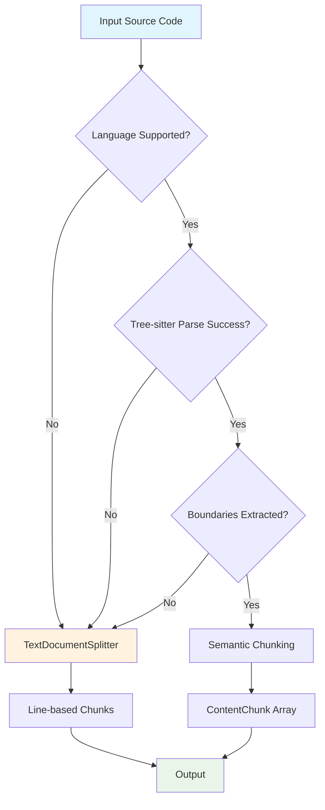
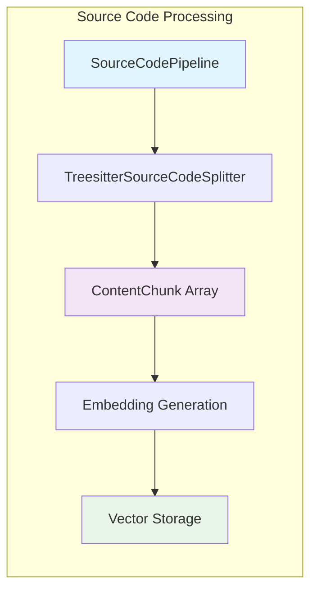

# Source Code Splitter Architecture

## Overview

The Source Code Splitter transforms source code files into hierarchical, concatenable chunks that preserve semantic structure while enabling effective code search. The system uses tree-sitter for precise syntax tree parsing to detect semantic boundaries, creating context-aware chunks that respect language structure.

## Design Philosophy

### Tree-sitter Semantic Boundaries

The splitter uses tree-sitter parsers to identify semantic boundaries in source code, providing:

- **Precision**: Syntax tree analysis ensures accurate boundary detection
- **Language Awareness**: Native support for JavaScript, TypeScript, JSX, and TSX
- **Semantic Chunking**: One chunk per function/method/class with proper hierarchy
- **Hierarchical Structure**: Chunks maintain proper nesting relationships

### Documentation-Focused Chunking

The chunking strategy prioritizes indexing public interfaces and maintaining comment-signature relationships:

- **Public Interface Emphasis**: Captures outward-facing class methods and top-level functions
- **Comment Preservation**: Documentation comments stay with their associated code
- **Hierarchical Paths**: Enable semantic search within code structure
- **Concatenable Chunks**: Chunks can be reassembled to reconstruct original context

## Architecture Components

## Core Components

### 1. Tree-sitter Language Parsers

The system supports multiple languages through dedicated tree-sitter parsers:

**Supported Languages:**

- **JavaScript**: ES6+ classes, functions, arrow functions, JSX elements
- **TypeScript**: Interfaces, types, enums, namespaces, decorators, generics, TSX
- **JSX/TSX**: React component parsing with TypeScript integration

**Language Registry:**
The `LanguageParserRegistry` automatically selects the appropriate parser based on file extension and content analysis, falling back to `TextDocumentSplitter` for unsupported languages.

### 2. Semantic Boundary Detection

Tree-sitter parsers identify structural elements through syntax tree traversal:

**Primary Boundaries:**

- **Classes**: Complete class definitions with all members
- **Functions**: Top-level function declarations and expressions
- **Methods**: Class and interface method definitions
- **Interfaces**: TypeScript interface declarations
- **Namespaces**: TypeScript namespace blocks
- **Types**: Type alias definitions

**Boundary Extraction:**
Each boundary includes start/end positions, basic type classification, and optional name for context. The system focuses on structural boundaries rather than detailed metadata extraction.

### 3. Hierarchical Chunking Strategy

The chunking approach creates semantic units that respect code structure:

**Chunking Rules (Canonical Ruleset):**

Core Principles:

- **Semantic Fidelity**: Boundaries align with grammar-level constructs (namespace/module, class, interface, enum, type alias, function/method/constructor).
- **Hierarchical Integrity**: Every chunk has a full path (e.g. `['File.ts', 'Namespace', 'ClassName', 'methodName']`).
- **Perfect Reconstructability**: Concatenating chunks in emission order reproduces the exact original file bytes.
- **Retrieval Granularity**: Prefer the smallest semantically meaningful unit (do not merge adjacent declarations).

Boundary Emission:

- Emit a primary chunk for each declaration that introduces a named scope or executable unit:
  - Namespaces / modules
  - Classes / interfaces / enums / type aliases
  - Top-level functions (regular / async / arrow assigned via `const`)
  - Methods / constructors (including `static` / `private` / accessor forms)
- Do NOT emit chunks for internal control-flow (`if`, `for`, `switch`, etc.) or nested local helper functions inside another function/method body (these remain part of the parent body chunk).
- Transparent wrappers (`export`, `declare`, modifiers) never suppress boundary emission; they are included in the declaration chunk content.

Classification (Dual Typing):

- `boundaryType: "structural"` for: namespace/module, class, interface, enum, type alias, import/export units.
- `boundaryType: "content"` for: function, method, constructor, arrow function, variable declaration introducing executable code.
- All chunks include `types: ['code']` for backward compatibility; semantic classification augments, not replaces, existing type labels.

Documentation & Signature Association:

- Preceding contiguous documentation comments (JSDoc / multi-line block / meaningful line comments) are merged into the declaration chunk.
- Documentation scan crosses transparent wrappers (e.g. `export` before `class`).
- Chunk `startLine` and `startByte` are adjusted to the first doc line when docs are present.

Atomicity & Non-Merging:

- Never merge two siblings (e.g. two methods, function + next function, class + first method).
- Never merge a structural declaration with its first child declaration.
- A method/function body is treated as a single atomic content region unless size splitting (see Size Management) is triggered.

Size Management (Universal Max Size Enforcement):

- No emitted chunk may exceed the configured maximum size (bytes or token estimate surrogate). This rule applies to:
  - Declaration (structural) segments (e.g. large class/interface/enum declarations with decorators or long heritage clauses)
  - Function/method/constructor bodies
  - Interstitial / global content between declarations
  - Any trailing or leading whitespace/comment regions
- Oversized segments are **delegated** to the `TextSplitter` AFTER semantic boundary determination so structural intent is preserved.
- Sub-chunks produced from delegation:
  - Preserve strict original ordering
  - Inherit the parent path (adding a deterministic ordinal suffix only if needed for uniqueness, e.g. `MyClass/doWork#1`, `MyClass/doWork#2`)
  - Are all classified as `boundaryType: "content"` unless they correspond to the first structural declaration slice (which remains `structural` if it contains the signature/docs)
  - Never duplicate signature or doc lines
- Structural declaration chunk strategy:
  - Signature + docs remain in the first chunk (always under max size due to early split trigger on large bodies/content)
  - Body content beyond the first segment is delegated in slices as needed
- Guarantees:
  - Perfect reconstructability (concatenation of all chunks == original file)
  - Deterministic chunk boundaries for identical inputs/config
  - No late greedy merging stage; only size-driven subdivision

Path & Hierarchy:

- Each emitted chunk path is the full ancestry of structural declarations.
- Sub-chunks produced by size delegation extend that path deterministically (ordinal suffix or segmented identifier) without inventing new semantic ancestors.

Wrapper & Modifier Handling:

- `export`, `default`, `abstract`, `async`, visibility (`public|private|protected`), and decorators remain within the declaration chunk.
- Multiple stacked modifiers do not produce multiple chunks.

Content Integrity:

- No duplication: bytes belong to exactly one chunk except optional intentional signature/body split (if implemented).
- No gaps: every byte of the original file is covered by exactly one chunk (structural + body subdivision collectively).

Suppression Rules:

- Suppress nested function-like declarations only when they are local (declared inside another function/method body) AND not part of the public structural surface (they remain embedded implementation details).
- Do not suppress functions declared directly inside namespaces or classes (those emit boundaries).

Fallback & Error Resilience:

- On parser failure / zero boundaries: fall back to line-based splitter preserving reconstructability.
- On partial parse (ERROR nodes): still emit any confidently parsed boundaries; malformed regions become part of surrounding content.

Determinism:

- Given identical source input and configuration, chunk boundaries (names, byte ranges, hierarchy) are deterministic.

Extensibility:

- New structural kinds (e.g. `trait`, `record`, future TS constructs) must specify:
  - Classification (structural vs content)
  - Inclusion in documentation merging rules
  - Whether they introduce a hierarchical path segment.

Implementation Notes:

- Boundary traversal is single-pass with documentation accumulation.
- Size threshold should be configurable (env / constructor option).
- Delegated sub-chunks MUST NOT exceed the max size individually.
- Token estimation (if used) should degrade gracefully to byte length.

Testing Guidelines:

- Assert reconstructability (join == original).
- Assert presence + uniqueness of expected paths.
- Assert doc block capture (start line alignment).
- Assert large body subdivision ordering & naming.
- Assert no emission for nested local helpers.
- Assert classification correctness (`structural` vs `content`).

Summary:

- Structural nodes = skeleton for hierarchical reassembly.
- Content nodes = precise retrieval targets.
- Large bodies subdivided AFTER boundary identification without erasing the semantic anchor.

### 4. Content Processing Pipeline

## Processing Flow

### Semantic Chunking Process

### Chunk Generation Strategy

The system creates chunks that balance semantic meaning with search effectiveness:

**Chunk Types:**

- **Structural Chunks**: Class/function/interface signatures with documentation
- **Method Chunks**: Complete method implementations including comments
- **Content Chunks**: Code sections between structural boundaries
- **Delegated Chunks**: Large content sections processed by TextSplitter

#### Dual Typing & Boundary Classification

Each emitted `ContentChunk` for source code now uses a dual typing strategy:

- `types` array always includes `code` (backward compatibility for existing retrieval / embedding logic).
- A secondary semantic classification is derived from boundary analysis:
  - `boundaryType: "structural"` for declarations that introduce _named, nestable scopes_ (classes, interfaces, enums, namespaces/modules, type aliases, import/export units).
  - `boundaryType: "content"` for executable or implementation-level units (functions, methods, constructors, arrow functions, variable/lexical declarations that carry behavior, etc.).

Design goals:

1. Hierarchical Assembly: `structural` nodes act as stable anchors for subtree reconstruction (e.g. return an entire class when a method matches).
2. Precision in Retrieval: `content` nodes map to the most specific executable region, improving ranking granularity.
3. Non-Destructive Enrichment: Existing consumers relying only on `types.includes("code")` remain unaffected.
4. Future Extensibility: Additional refinement layers (e.g. `interface-signature`, `public-api`, `test-code`) can be layered without breaking current contracts.

Why not merge structural + content nodes pre-index?

- Merging obscures which textual spans define navigational structure vs. executable implementation.
- Preserving both classifications enables context-dependent expansion policies (e.g. include whole class vs. just matched method).

Boundary integrity + dual typing replace the need for post-hoc greedy size normalization.

**Path Inheritance:**
Each chunk inherits the hierarchical path of its containing structure, enabling context-aware search and proper reassembly.

## Error Handling & Fallback Strategy

### Graceful Degradation

The splitter handles various scenarios through layered fallback mechanisms:

**Fallback Scenarios:**

- **Unsupported Languages**: Automatic delegation to TextDocumentSplitter
- **Parse Errors**: Graceful fallback for malformed syntax
- **Boundary Detection Failures**: Line-based processing for complex edge cases
- **Large File Handling**: For files exceeding a universal 32KB limit in the underlying parser, the system provides graceful degradation. It performs a full semantic parse on the initial ~32KB and falls back to `TextDocumentSplitter` for the remainder of the file, ensuring that no content is lost

### Error Recovery

The system maintains robust operation through:

- **Parse Error Isolation**: Errors in one section don't affect others
- **Content Preservation**: All source content is retained in chunks
- **Consistent Interface**: All fallback paths produce compatible ContentChunk arrays

## Language Extensibility

### Current Language Support

The tree-sitter implementation provides comprehensive support for web development languages:

**JavaScript (ES6+):**

- Classes with methods and properties
- Functions (regular, async, arrow functions for top-level declarations)
- JSX elements and React components
- Import/export statements

**TypeScript:**

- All JavaScript features plus type system constructs
- Interfaces and type alias definitions
- Namespaces and modules
- Enums and decorators
- Generic type parameters
- TSX (TypeScript + JSX)

**Python:**

- Classes, functions, and methods
- `import` and `from...import` statements
- Decorators and `async` functions

### Architecture for Extension

The modular design supports future language additions through:

**Parser Registry System:**

- Automatic language detection by file extension
- Fallback mechanisms for unsupported languages
- Consistent interface across all language parsers

**Tree-sitter Integration:**

- Leverages existing tree-sitter grammar ecosystem
- Language-specific parsers implement common boundary extraction interface
- Shared infrastructure for syntax tree traversal and boundary detection

**Future Language Candidates:**

- Java (packages, classes, methods)
- C# (namespaces, classes, properties, methods)
- Go (packages, structs, methods, functions)
- Rust (modules, structs, impl blocks, functions)

## Integration with Pipeline System

### Source Code Processing Pipeline

The tree-sitter splitter integrates seamlessly with the existing content processing infrastructure:

### Rationale: Omission of Greedy Size-Based Merging

The previous design showed an additional GreedySplitter phase for size normalization. This has been intentionally removed for source code because:

- Structural Fidelity: Treesitter-derived chunks encode precise `{level, path}` hierarchies required for hierarchical reassembly and subtree reconstruction. Greedy merging collapses boundaries and degrades that signal.
- Retrieval Quality: HierarchicalAssemblyStrategy relies on intact structural units (class, method, function). Artificially merged aggregates reduce precision and introduce unrelated code into a match context.
- Reassembly Guarantees: The splitter already guarantees concatenability. Additional size-based merging provides negligible token efficiency gains compared to the semantic loss.
- JSON / Structured Parity: The same reasoning applies to JSON and other strictly nested formats—each structural node is meaningful even if its textual size is small.
- Simplicity & Predictability: A single semantic splitter reduces mental overhead, improves test determinism, and avoids edge cases where mixed-level metadata must be reconciled.

If future optimization is needed, it should be: (a) post-retrieval context window packing, or (b) language-aware micro-chunk collapsing that preserves explicit structural node boundaries—never generic greedy adjacency merging.

### System Benefits

**Enhanced Search Quality:**

- Semantic chunks respect code structure boundaries
- Hierarchical paths enable context-aware retrieval
- Documentation comments stay associated with relevant code
- Function and method retrieval maintains complete context

**Performance Characteristics:**

- Tree-sitter parsing provides linear time complexity
- Memory efficient processing without large intermediate structures
- Robust error handling prevents pipeline failures
- Maintains compatibility with existing chunk optimization systems

**Developer Experience:**

- Search results respect semantic boundaries
- Retrieved chunks include necessary surrounding context
- Hierarchical structure aids in understanding code relationships
- Consistent interface with other document processing pipelines
